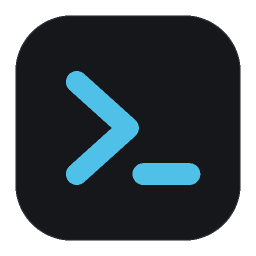

<div align="center">



# CMD ALL-IN-ONE

**E-mail, chamados e WhatsApp do suporte em uma única tela de terminal.**

Um dashboard TUI que fica aberto o dia todo ao lado do seu trabalho: ele vigia a caixa de
entrada, os chamados do Milldesk no seu nome e as conversas que estão com você no
ChatPanel — e avisa quando algo muda.

[](https://github.com/GuiPolezi/Karen-TUI/releases/latest)
[](https://github.com/GuiPolezi/Karen-TUI/releases)
[](https://github.com/GuiPolezi/Karen-TUI/actions/workflows/release.yml)


### [⬇ Baixar a última versão](https://github.com/GuiPolezi/Karen-TUI/releases/latest)

Instalador de Windows, sem senha de administrador, sem instalar Python.

</div>

```
 ▍CMD ALL-IN-ONE  Dashboard               ● ● ●                       Guilherme  08:14:20
  ▍✉ E-MAIL                                                                  30s · há 6s
  142 inbox · 7 não lidos · 3 spam

   Fulano de Tal <fulano@cm.sp.gov.br>                                           08:11
   Erro ao gerar relatório de empenhos
   Bom dia, ao tentar gerar o relatório de empenhos do mês o sistema apresenta a mensag…

   ▍07:33   RE: Acesso ao portal da transparência
    07:02   [#4831] Novo chamado atribuído a você                                      ▅
    05:14   Certificado digital vencendo
  +4 · F2
   ▣ MILLDESK                                                               60s · há 27s
  12 abertos no meu nome · 1 vencido

  Em atendimento 7 · Aguardando cliente 4 · Pausado 1
  SLA ▸ #4802 Certificado digital do prefeito vencendo          ▮▮▮▮  vencido há 01h05

    #4802   Certificado digital do prefeito vencendo                          -01h05
    #4821   Backup noturno não executa desde sexta                            01h41    ▅
    #4831   Impressora fiscal não imprime cupom                               05h59
    #4744   Câmera do plenário sem imagem                                     23h59
  +8 · F3

   ◉ CHATPANEL   3 conversas · 1 não lida                                    15s · há 1s

    ●  08:09  Diego Leone · PM Iar  Porta 21 continua fechada, consegue verificar  1
    ○  08:07  Hércules · CM Tatuí   Fabio: Hércules, consegue me mandar o print d      ▅
  +1 · F4   ·   4 com outros técnicos · 6 não lidas na aba
 ↑↓ mover  ⏎ abrir  ⇥ painel  / filtrar  o navegador  y copiar  e e-mail  ? ajuda
```

<sub>Dados de exemplo. Capturas de todas as telas em `docs/design/depois/`.</sub>

---

## O que ele mostra

| Painel | O que traz | De onde |
|---|---|---|
| **E-MAIL** | total, não lidos, spam e os e-mails mais recentes | IMAP, em modo somente leitura |
| **MILLDESK** | chamados abertos no seu nome, quebra por status e o SLA mais próximo | API REST do Milldesk |
| **CHATPANEL** | conversas do WhatsApp em atendimento com você e as não lidas | leitura do painel web |

Cada fonte é isolada: se o Milldesk cair, e-mail e ChatPanel continuam. Nenhuma delas
escreve nada — nada é marcado como lido, nenhum chamado é alterado.

Além do dashboard: listas navegáveis com filtro, detalhe de e-mail/chamado/conversa,
linha do tempo do dia, tela de saúde das fontes, bloco de notas, launcher de comandos,
temas e notificação (bell/toast) quando um contador sobe.

---

## Instalação

### 1. Baixar

Vá em **[Releases](https://github.com/GuiPolezi/Karen-TUI/releases/latest)** e baixe o
arquivo `CMD-ALL-IN-ONE-Setup-<versão>.exe`.

### 2. Instalar

Execute o instalador. Como o executável não é assinado, o Windows mostra
*"O Windows protegeu o seu computador"* na primeira vez — clique em
**Mais informações → Executar assim mesmo**.

O instalador:

- instala **por usuário** em `%LOCALAPPDATA%\Programs\CMD ALL-IN-ONE` (sem pedir senha de
  administrador);
- cria o atalho no menu Iniciar e, se você marcar, na área de trabalho — os dois abrem no
  **Windows Terminal**, que é onde as cores e os ícones ficam certos;
- aparece em Adicionar/Remover Programas como qualquer outro aplicativo.

> O atalho aponta para o `wt.exe` (Windows Terminal) passando o caminho do programa. Por
> isso "Abrir local do arquivo" leva para a pasta `WindowsApps`, e não para a do programa.

### 3. Primeira execução

Abra pelo atalho. Ele vai:

1. criar a pasta de dados `%LOCALAPPDATA%\CMD-ALL-IN-ONE`, gerar um `.env` em branco e
   abri-lo no bloco de notas. **Preencha e feche o programa** (veja
   [Configuração](#configuração));
2. na abertura seguinte, baixar o Chromium usado para ler o ChatPanel (~700 MB, uma única
   vez por máquina, com barra de progresso antes da TUI subir). Ele vai para
   `%LOCALAPPDATA%\ms-playwright`, fora da pasta do programa;
3. subir o dashboard.

Tudo que é seu — `.env`, `logs/`, `notes.md`, `prefs.json`, `themes/` e a sessão do
ChatPanel — fica na pasta de dados e **sobrevive a atualizações e à desinstalação**. O
caminho aparece na linha "Dados" da tela `F8`.

### Atualização

Ao abrir, a TUI pergunta ao GitHub qual é o último release. Havendo versão nova aparece
`⇡ 0.3.0` na barra superior, um aviso e a linha "Atualização" no `F8`.

**`Ctrl+U`** (ou `:atualizar` no launcher) baixa o instalador, mostra o progresso, fecha a
TUI, instala em silêncio e reabre o programa — sem tocar na sua configuração.
`UPDATE_CHECK=false` no `.env` desliga a verificação.

### Deu problema?

```powershell
& "$env:LOCALAPPDATA\Programs\CMD ALL-IN-ONE\CMD-ALL-IN-ONE.exe" --verificar
# e, para abrir o Chromium de verdade (leva alguns segundos):
& "$env:LOCALAPPDATA\Programs\CMD ALL-IN-ONE\CMD-ALL-IN-ONE.exe" --verificar --navegador
```

Imprime, em JSON, versão, caminhos, se o `.env` existe, quais navegadores estão baixados e
o que está faltando. Veja também [Solução de problemas](#solução-de-problemas).

---

## Configuração

O `.env` fica em `%LOCALAPPDATA%\CMD-ALL-IN-ONE\.env` (ou na raiz do projeto, se você roda
do código). O modelo vem **todo em branco**, com um comentário explicando cada variável e
o padrão de quem tem um. Preencha pelo menos:

| Variável | O que é |
|---|---|
| `TECH_NAME` | seu nome **exatamente** como aparece no ChatPanel e no Milldesk |
| `EMAIL_IMAP_HOST`, `EMAIL_USER`, `EMAIL_APP_PASSWORD` | servidor e caixa de e-mail (se a senha tiver `#` ou `*`, deixe entre aspas simples) |
| `MILLDESK_API_KEY` | chave da API do Milldesk |
| `MILLDESK_AGENT_NAME` | só se o seu nome no Milldesk for diferente do `TECH_NAME` |
| `CHATPANEL_URL` | endereço do `chat.php` do seu painel |

Regras:

- variável obrigatória **em branco ou ausente** aborta o app com a lista do que falta
  (`TECH_NAME`, `EMAIL_IMAP_HOST`, `EMAIL_USER`, `CHATPANEL_URL`);
- variável com padrão pode ficar em branco: o app usa o padrão;
- segredo vazio (`EMAIL_APP_PASSWORD`, `MILLDESK_API_KEY`) **não** aborta: aquele painel
  mostra "não configurado" e os outros seguem funcionando;
- intervalos de atualização precisam ser de pelo menos 5 segundos;
- **nunca** escreva comentário na mesma linha de uma variável: o `python-dotenv` — transforma o comentário em valor.

---

## Uso

A TUI tem nove telas. Os coletores continuam rodando em qualquer uma delas, e a última
tela aberta é lembrada em `prefs.json`.

| Tecla | Ação |
|---|---|
| `F1` / `d` | Dashboard (três painéis compactos) |
| `F2` | E-mail: últimos `EMAIL_LIST_SIZE` e-mails (`u` alterna "só não lidos") |
| `F3` | Milldesk: chamados abertos no meu nome (`s` alterna a ordenação: SLA, data, status) |
| `F4` | ChatPanel: minhas conversas (`t` mostra/esconde as "com outros técnicos") |
| `F5` / `l` | Log: últimas 300 linhas de `logs/app.log` (`f` alterna o filtro de nível) |
| `F6` | Notas: bloco de notas salvo em `notes.md` (autosave; `Ctrl+S` salva agora) |
| `F7` | Eventos: linha do tempo do dia, persistida em `logs/events-AAAA-MM-DD.jsonl` (`x` limpa a tela) |
| `F8` | Saúde: uma linha por fonte (status, última coleta, duração, próximo ciclo, latência), chamadas do Milldesk no último minuto, sessão do ChatPanel, caminhos e versões |
| `F9` | Temas: lista navegável com preview ao vivo (`Enter` confirma, `Esc` volta) |
| `Enter` | abrir o item: e-mail completo, detalhe do chamado (descrição, SLA regressivo, comunicações) ou a conversa do WhatsApp |
| `↑` `↓` `j` `k` `PgUp` `PgDn` `Home` `End` | mover o cursor |
| `Esc` | fechar o detalhe, limpar o filtro ou voltar ao Dashboard |
| `Tab` / `Shift+Tab` | trocar o painel focado no Dashboard |
| `/` | filtro incremental (nome, assunto, número, status) |
| `o` · `y` | abrir no navegador · copiar o identificador |
| `e` | abrir o e-mail mais recente de qualquer tela |
| `r` · `1` `2` `3` | atualizar tudo · uma fonte |
| `c` | abrir a janela de login do ChatPanel |
| `m` | modo silêncio por 30 minutos |
| `T` | próximo tema |
| `Ctrl+U` | instalar a atualização disponível |
| `:` · `?` · `q` | launcher · ajuda · sair |

<details>
<summary><b>Launcher (<code>:</code>) — uma linha de comando dentro da TUI</b></summary>

`Enter` executa, `↑`/`↓` percorrem o histórico (50 últimos, em `prefs.json`), `Esc` fecha.
Enquanto você digita, ele sugere os comandos que começam com o texto.

| Comando | Ação |
|---|---|
| `termo` ou `g termo` | pesquisa no motor padrão (`SEARCH_ENGINE_URL`, Google por padrão) |
| `ddg termo`, `yt termo` | DuckDuckGo, YouTube |
| `md 1234` | abre o detalhe do chamado na TUI |
| `md! 1234` | abre o Milldesk no navegador e copia o ID (o Milldesk não tem URL por chamado) |
| `wa 5511999999999` | abre `wa.me` com o número |
| `cp`, `mail`, `mdweb` | abre ChatPanel, webmail, Milldesk (URLs do `.env`) |
| `open url` | abre uma URL qualquer |
| `fav nome` · `fav add nome url` · `fav rm nome` · `fav` | favoritos em `prefs.json` |
| `email`, `tickets`, `chats`, `log`, `notes`, `dash` | troca de tela |
| `refresh` · `refresh md` | atualiza tudo · uma fonte |
| `theme` · `theme nome` · `theme next` | lista · aplica · próximo tema |
| `theme preview` · `theme export wt` | tela de temas · esquema de cores para o Windows Terminal |
| `atualizar` | o mesmo que `Ctrl+U` |
| `help` | lista de comandos |

Limitação do sistema operacional: abrir o navegador tira o foco do terminal e o app não
tem como trazê-lo de volta. No Windows Terminal, um atalho global (por exemplo o modo
"quake" em ``Win+` ``) volta para a TUI com uma tecla.

</details>

<details>
<summary><b>Detalhes da interface (destaques, SLA, estados, layout)</b></summary>

No painel Milldesk, o chamado com o SLA mais próximo aparece em linha própria
(`SLA ▸ #id assunto ▮▮▮▯ faltam 1h41`): a cor fica só na barra e no tempo (verde, âmbar
abaixo de 4 h, vermelho abaixo de 30 min ou vencido). Abaixo de 30 min o tempo pisca uma
vez por segundo; `SLA_BLINK=false` (ou `TEXTUAL_ANIMATIONS=none`) desliga.

Ao voltar ao Dashboard depois de ficar em outra tela, um aviso resume o que mudou
("enquanto você estava fora: e-mail: não lidos · ChatPanel: conversas"). Itens novos ou
com não lidas a mais ganham um marcador `▎` na cor de destaque por 3 segundos, e o
contador que subiu fica destacado pelo mesmo tempo. O cursor da lista não se perde quando
o painel atualiza: a seleção é mantida pelo identificador do item.

Quando um contador aumenta entre dois ciclos, o terminal toca o bell; `NOTIFY_BELL=false`
desliga o som mantendo o destaque, e `NOTIFY_TOAST=true` (com `pip install winotify`)
adiciona uma notificação do Windows.

Estados têm desenho próprio: erro sem dados (`✗`, a mensagem e a tecla que tenta de novo),
erro com dados antigos (a lista continua, com `✗ mensagem · há N min` no rodapé), não
configurado (`–` e a variável do `.env`), vazio (`✓ nenhum chamado no seu nome`),
coletando (spinner) e cooldown de 429 (`aguardando 2m40`).

Layout responsivo: com menos de 100 colunas os painéis de E-mail e Milldesk empilham; com
30 linhas ou mais os contadores do Dashboard viram números grandes; com menos de 25 linhas
sobram só os contadores e a linha de SLA.

</details>

<details>
<summary><b>Aparência e temas</b></summary>

A TUI usa **tokens semânticos** (`bg`, `surface`, `text`, `text-muted`, `text-faint`,
`accent`, `ok`, `warn`, `danger`...) em vez de cores: cada tema é uma paleta que preenche
esses tokens. Uma única cor de destaque (`accent`) marca foco, seleção, teclas e o que
mudou; verde/âmbar/vermelho aparecem só para estado.

| Onde | O quê |
|---|---|
| `THEME=carbon` no `.env` | tema padrão. Embutidos: `carbon` (quase-preto, destaque ciano), `phosphor` (verde CRT), `amber`, `paper` (claro), `terminal` (usa as 16 cores do próprio Windows Terminal) e os temas do Textual `nord`, `gruvbox`, `catppuccin-mocha`, `dracula`, `tokyo-night`, `monokai`, `flexoki` |
| `T` · `theme nome` · `F9` | trocar de tema em tempo de execução (fica em `prefs.json`, que tem prioridade sobre o `.env`) |
| `themes/*.json` | temas seus: copie `themes/exemplo.json`, troque as cores e reinicie. Arquivo inválido é ignorado com aviso no log; contraste baixo gera aviso, mas o tema entra |
| `ICONS=auto` | `unicode` no Windows Terminal, `ascii` no conhost; `nerd` só se a fonte do terminal for uma Nerd Font |
| `theme export wt` | grava o esquema do tema atual para o `settings.json` do Windows Terminal e copia o JSON |

**Windows Terminal recomendado:** fonte `Cascadia Code` 11 (já vem instalada; para ícones
Nerd Font, `CaskaydiaCove Nerd Font Mono` 11 e `ICONS=nerd`), `padding: 4`,
`useAcrylic: false` (o acrílico apaga o texto secundário), `intenseTextStyle: "bold"`,
`cursorShape: "bar"`, barra de rolagem oculta. O trecho pronto está em
`docs/design/windows-terminal/perfil-sugerido.json`, com um esquema de cores por tema.
Quem prefere as cores do próprio terminal usa `THEME=terminal`.

O guia de estilo completo está em `docs/design/DIRECAO.md`.

</details>

---

## As três fontes

<details>
<summary><b>E-mail (IMAP)</b></summary>

- A pasta é aberta em modo **somente leitura**: nada é marcado como lido.
- Porta 143 com `EMAIL_IMAP_STARTTLS=true` usa STARTTLS. Se o servidor recusar, o app cai
  para SSL direto na porta 993 e registra um aviso em `logs/app.log`. Porta 143 com
  STARTTLS desligado é recusada: a senha nunca sai em texto puro.
- `EMAIL_SPAM_FOLDER` é opcional; se a pasta não existir, o contador de spam some.
- Datas são convertidas para o fuso local.
- A conexão fica aberta entre ciclos e reconecta sozinha se cair.
- Se a caixa for compartilhada pela equipe, "não lidos" reflete a equipe toda.

</details>

<details>
<summary><b>Milldesk</b></summary>

- `ticketsByAgent.amount` é o **histórico** de chamados do técnico, não os abertos.
- Para contar os abertos, o app usa `ticketsByStatus` (agregado leve) para descobrir quais
  status têm chamados e chama `showTicketsByStatus?status=...` só para esses, filtrando
  pelo campo `agent`. `Fechado` nunca é consultado.
- O painel mostra **"Abertos no meu nome"** como destaque, a quebra por status, até 3
  chamados (mais recentes primeiro) e o histórico como linha secundária.
- Peculiaridades da API: `starttime` às vezes vem com a data junto, `slasexpirationdate`
  pode ser texto (`Em pausa`), e erros vêm com HTTP 200 e corpo `{"error": "invalidApiKey"}`.
- O nome no Milldesk pode ser diferente do nome no ChatPanel: use `MILLDESK_AGENT_NAME`.
  A comparação é exata (ignorando acentos e maiúsculas), então cuidado com homônimos.
- Só rotas de leitura são usadas. `addTicket`, `updateTicketStatus` e `sendCommunication`
  nunca são chamadas.

**Limite de requisições:** a API responde `HTTP 429` com cerca de dez chamadas por minuto.
Por isso a coleta é incremental: todo ciclo faz só uma chamada (`ticketsByStatus`) e
compara as quantidades por status com o ciclo anterior; `showTicketsByStatus` só é chamada
para os status que mudaram; `ticketsByAgent` e uma recarga completa acontecem a cada 10
minutos; as chamadas são sequenciais, com 0,4 s entre elas; um `429` não é retentado — o
painel mostra o erro, espera 3 minutos e mantém os últimos dados na tela.

</details>

<details>
<summary><b>ChatPanel (WhatsApp)</b></summary>

O ChatPanel não tem API. O app usa um Chromium headless (Playwright) com perfil persistente
que fica com o painel aberto e, a cada `CHATPANEL_REFRESH_SECONDS`, lê o HTML e extrai as
conversas com BeautifulSoup. A página não é recarregada a cada ciclo: o socket.io do painel
já atualiza o DOM.

**Login (sempre humano: a tela tem captcha).** O app abre a janela e pré-preenche o que
pode; você responde o captcha e clica em "Acessar Painel".

- Ao iniciar, se a sessão estiver expirada (ou ainda não houver perfil salvo), ele abre
  sozinho um Chromium visível **uma vez por execução** (`CHATPANEL_LOGIN_ON_START=true`).
- A tecla `c` abre a janela a qualquer momento.
- `CHATPANEL_USER` e `CHATPANEL_PASSWORD` deixam usuário e senha já preenchidos; sobra só
  o captcha. A senha é mascarada nos logs.
- A janela espera 5 minutos; se fechar antes ou o tempo acabar, o painel mostra o motivo e
  `c` tenta de novo.

O servidor **desloga o usuário quando o socket dele desconecta** (medido em 15/09/2026).
Por isso a janela de login usa um perfil separado (`.chatpanel-profile-login/`) e o app
sobe o Chromium headless, com os cookies salvos, **antes** de fechar a janela. Duas
consequências: fechar a TUI desloga o usuário dedicado (deixe a TUI aberta durante o dia),
e `python scripts\chatpanel_login.py` só serve para conferir credenciais.

Os cookies ficam em `CHATPANEL_PROFILE_DIR/session.bin`, protegidos com o DPAPI do Windows
(só o seu usuário consegue ler). Apague o arquivo para forçar um novo login.

**Usuário dedicado (recomendado).** O ChatPanel mantém uma sessão ativa por usuário. Se o
app usar o mesmo usuário do técnico, cada ação no navegador invalida a sessão do app no
servidor. Com um usuário criado só para a TUI:

- coloque as credenciais dele em `CHATPANEL_USER`/`CHATPANEL_PASSWORD`; `TECH_NAME`
  continua sendo o **seu** nome, que é o que aparece no badge das conversas;
- a cada `CHATPANEL_RESYNC_SECONDS` (padrão 60) o app refaz dentro da página as mesmas
  chamadas que o painel usa ao limpar a busca, então uma **transferência** ou uma
  **reatribuição pelo perfil do contato** entra ou sai do seu nome em até um minuto, sem
  depender de mensagem nova (nenhuma das duas gera evento de socket; validado em
  15/09/2026). `0` desliga;
- o usuário dedicado só enxerga conversas dos **departamentos em que está cadastrado**;
- seu login no navegador e o do app deixam de se derrubar.

**Ler uma conversa (`Enter`).** O app faz, dentro da página, a mesma requisição que o
painel usa para mostrar a conversa, **sem** clicar nela: medido em 15/09/2026
(`docs/CHATPANEL_CONVERSA.md`), isso não marca como lida no servidor nem gera evento para
as outras sessões. Enquanto a tela está aberta, uma mensagem nova recarrega a conversa
sozinha. `CHATPANEL_READ_CONVERSATIONS=false` desliga a leitura.

**O que o painel conta.** Conversas em "SUAS CONVERSAS" contam sempre; as de "EM
ATENDIMENTO" contam quando o badge de pessoa é igual a `TECH_NAME`. Números repetidos são
deduplicados. Por conversa: online, hora, contato, tag, departamento, última mensagem e
não lidas. No rodapé: quantas estão com outros técnicos e o total de não lidas da aba.

**Diagnóstico.** `python scripts\chatpanel_diag.py --watch 180` (com a TUI fechada) grava
em `logs/chatpanel_diag/` o DOM, as respostas cruas dos endpoints e os eventos do socket.
Foi assim que o comportamento acima foi medido.

</details>

---

## Desenvolvimento

```powershell
git clone https://github.com/GuiPolezi/Karen-TUI.git
cd Karen-TUI

python -m venv .venv
.venv\Scripts\Activate.ps1
python -m pip install --upgrade pip
python -m pip install -e ".[dev]"
playwright install chromium          # ~700 MB, uma vez por máquina

Copy-Item .env.example .env
notepad .env

python -m app
```

Requisitos: Windows 10/11, Python 3.11+ e Git. Rodando do código, a pasta de dados é a
própria raiz do projeto (`.env`, `logs/`, `prefs.json`, `notes.md` ficam ali).

| Comando | Para quê |
|---|---|
| `python -m pytest` | a suíte inteira (inclui snapshots da TUI) |
| `python -m app --verificar` | caminhos, configuração, dependências e navegador, em JSON |
| `python -m app.sources.email_imap` (ou `milldesk`, `chatpanel`) | modo debug de uma fonte: imprime o estado em JSON e sai |
| `python -m app.sources.chatpanel tests\fixtures\chatpanel_chat.html` | roda só o parser do ChatPanel, offline |
| `scripts\criar_atalho.ps1` | atalho na área de trabalho que abre a versão do repositório no Windows Terminal e atualiza pelo `git pull` |

Logs em `logs/app.log`, com rotação (1 MB, 3 arquivos). Chave do Milldesk e senhas
aparecem mascaradas (`****1776`, `********`). Nada é impresso no terminal enquanto a TUI
está aberta.

<details>
<summary><b>Gerar o executável e publicar uma versão</b></summary>

```powershell
powershell -ExecutionPolicy Bypass -File scripts\build.ps1
#   -PularTestes       pula o pytest
#   -PularInstalador   só a pasta dist\CMD-ALL-IN-ONE
#   -PularNavegador    pula o teste que abre o Chromium
```

O build roda os testes, gera o ícone, empacota com o PyInstaller
(`packaging\cmd-all-in-one.spec`), confere o executável com `--verificar` e, se o
[Inno Setup 6](https://jrsoftware.org/isdl.php) estiver instalado
(`winget install JRSoftware.InnoSetup`), monta `dist\CMD-ALL-IN-ONE-Setup-<versão>.exe`.
O Chromium **não** entra no pacote (são 700 MB): quem baixa é a primeira execução.

Publicar é uma linha:

```powershell
powershell -ExecutionPolicy Bypass -File scripts\publicar.ps1 -Versao 0.3.0
```

Isso carimba `app/__init__.py`, commita, cria a tag `v0.3.0` e empurra. O GitHub Actions
(`.github/workflows/release.yml`) roda os testes, monta o instalador no `windows-latest` e
o anexa ao release — é exatamente o arquivo que o `Ctrl+U` das outras máquinas vai baixar.
A tag precisa bater com o `__version__`, senão o workflow falha de propósito. Para testar o
pipeline sem gastar uma versão, use **Run workflow** na aba Actions: sem tag ele monta e
guarda o instalador como artefato, sem publicar release.

</details>

<details>
<summary><b>Como o projeto está organizado</b></summary>

| Caminho | O que tem |
|---|---|
| `app/config.py` | lê o `.env` e valida; variável obrigatória em branco aborta, segredo vazio marca a fonte como não configurada |
| `app/paths.py` | pasta do pacote (só leitura) × pasta de dados do usuário; todo caminho sai daqui |
| `app/firstrun.py` | primeira execução: pasta de dados, `.env` a partir do modelo e download do navegador |
| `app/update.py` | verificação de versão nos dois modos (release do GitHub e `git`) e instalação da atualização |
| `app/sources/` | uma fonte por arquivo, todas com `fetch()`, retry com backoff 2/4/8 s e timeout |
| `app/state.py`, `app/events.py` | o que as fontes publicam e o diff que vira evento |
| `app/tui/` | app, telas, painéis, temas e o launcher |
| `packaging/` | receita do PyInstaller e script do Inno Setup |
| `scripts/` | build, publicação, atalho, diagnósticos e capturas |
| `tests/` | 226 testes, incluindo snapshots visuais da TUI |
| `docs/design/` | guia de estilo, capturas e perfil do Windows Terminal |

A especificação original está em `PROMPT_CMD_ALL_IN_ONE.md`; as regras que valem para todo
o projeto, em `CLAUDE.md`.

</details>

<details>
<summary><b>Como chegamos até aqui (fases)</b></summary>

- [x] **Fase 0** — bootstrap: configuração, esqueleto da TUI, testes
- [x] **Fase 1** — E-mail (IMAP)
- [x] **Fase 2** — Milldesk
- [x] **Fase 3** — validação do Milldesk (`amount` é histórico; o painel usa `showTicketsByStatus`)
- [x] **Fase 4** — ChatPanel (Playwright, login humano integrado à TUI)
- [x] **Fase 5** — polimento: destaque + bell, painel de log, detalhe do e-mail, coleta
      incremental do Milldesk por causa do limite de requisições
- [x] **Fase 6** — navegação: nove telas, launcher, listas com cursor, detalhes de
      e-mail/chamado/conversa, eventos, saúde
- [x] **Fase 7** — design: tokens e temas, TopBar com a saúde das fontes, rodapé próprio,
      Dashboard sem bordas com números grandes, estados desenhados, tela de temas,
      esquemas para o Windows Terminal
- [x] **Fase 8** — executável: instalador do Windows, pasta de dados separada do programa,
      primeira execução que cria o `.env` e baixa o Chromium, atualização pelos releases do
      GitHub (`Ctrl+U`) e build automático no GitHub Actions

</details>

---

## Solução de problemas

- **"sessão expirada — pressione c para fazer login"** no painel do ChatPanel — A sessão salva não vale mais. Causa mais comum: alguém fez login com o mesmo usuário em outro navegador (o ChatPanel aceita uma sessão por usuário). Pressione `c` e refaça o login. Sem login, o app tenta de novo a cada 2 minutos.

- **"janela de login fechada antes de completar o login"** ou **"tempo esgotado (300s)..."** — A janela do Chromium foi fechada ou ficou 5 minutos sem login. Pressione `c` de novo.

- **A janela de login abre toda vez que inicio o app** — A sessão está sendo derrubada pelo seu login no navegador. Considere um usuário dedicado, ou desligue a abertura automática com `CHATPANEL_LOGIN_ON_START=false` e use `c`.

- **A TUI abriu, mas o Chromium não** / **"Executable doesn't exist at ..."** — Rode `--verificar --navegador` (executável) ou `playwright install chromium` (código).

- **"limite de requisições da API (HTTP 429 ...)"** no painel do Milldesk — A API recusou por excesso de chamadas. O painel mantém os últimos dados e espera 3 minutos. Se acontecer com frequência, aumente `MILLDESK_REFRESH_SECONDS` ou verifique se outro programa usa a mesma chave.

- **"técnico não encontrado na resposta"** no painel do Milldesk — `MILLDESK_AGENT_NAME` (ou `TECH_NAME`) não bate com nenhum `agent` da API e você não tem chamado aberto. Rode `python -m app.sources.milldesk` e confira a grafia exata.

- **"porta 143 sem STARTTLS enviaria a senha em texto puro"** no painel de e-mail — `EMAIL_IMAP_STARTTLS=false` com `EMAIL_IMAP_PORT=143`. Use `true`, ou porta `993`.

- **"LOGIN failed" ou "AUTHENTICATIONFAILED"** no painel de e-mail — Senha errada em `EMAIL_APP_PASSWORD`. Se ela tem `#` ou `*`, deixe entre aspas simples.

- **Acentos quebrados no terminal** — Use o Windows Terminal. No CMD antigo, rode `chcp 65001` antes de `python -m app`.

- **Painéis empilhados** — O terminal tem menos de 100 colunas. Alargue a janela; o layout volta sozinho.

- **Quero ver o que está acontecendo** — `F5` mostra o log dentro da TUI. `LOG_LEVEL=DEBUG` no `.env` registra cada ciclo de coleta.

---

<div align="center">
<sub>

Feito para o dia a dia do suporte — leitura apenas, nada é alterado nas fontes.
[Reportar um problema](https://github.com/GuiPolezi/Karen-TUI/issues) ·
[Releases](https://github.com/GuiPolezi/Karen-TUI/releases)

</sub>
</div>
